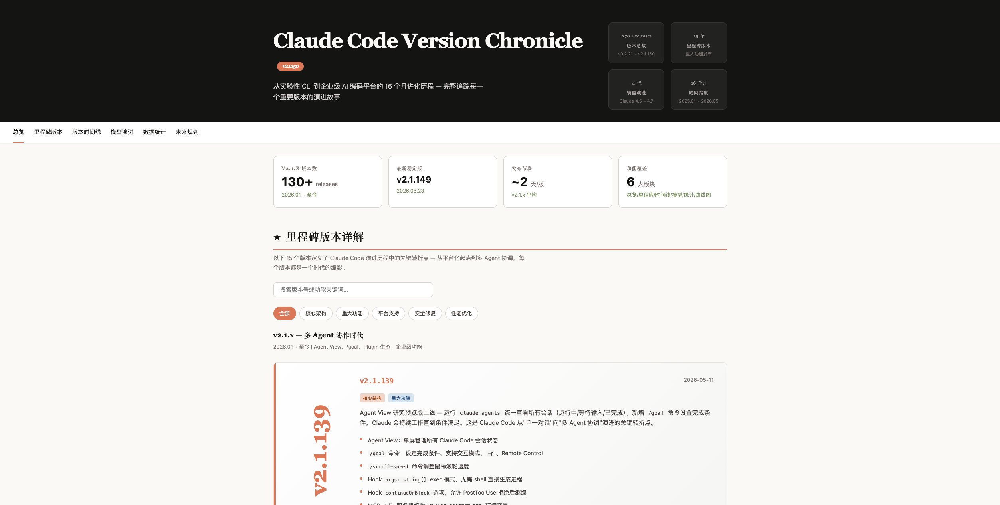
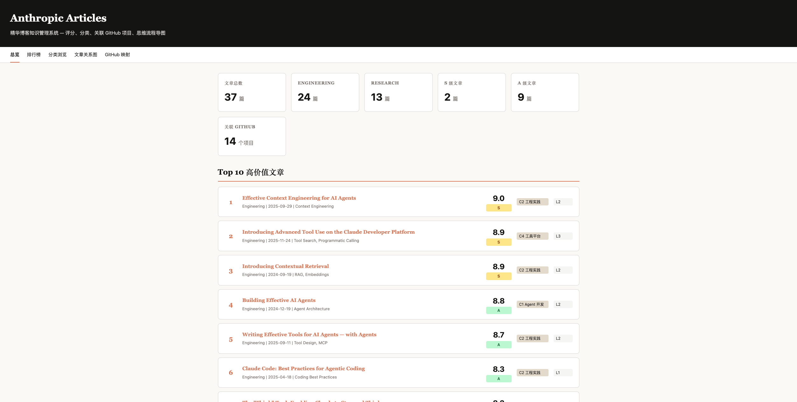
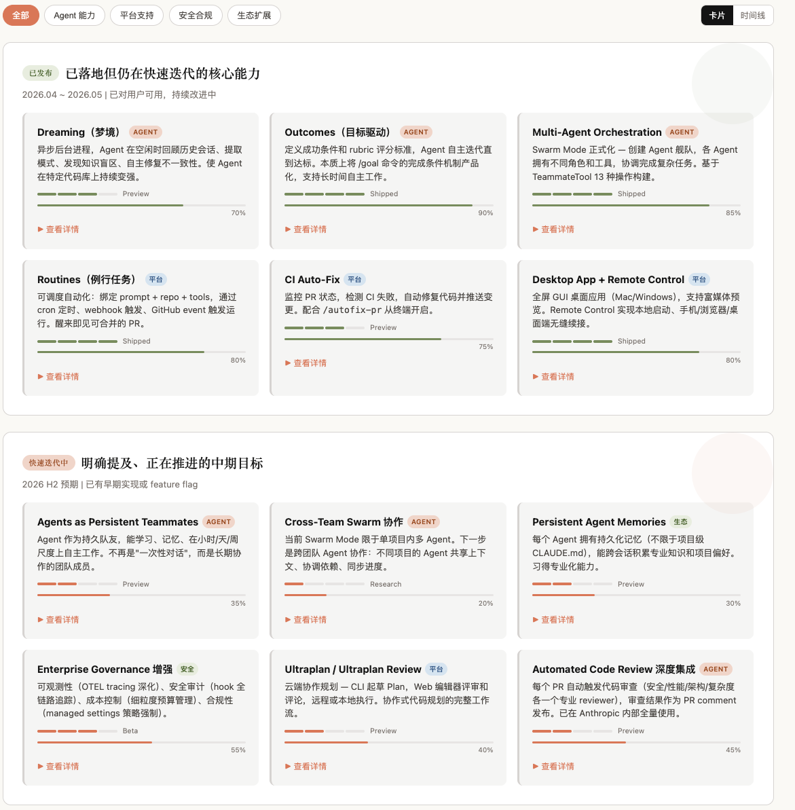
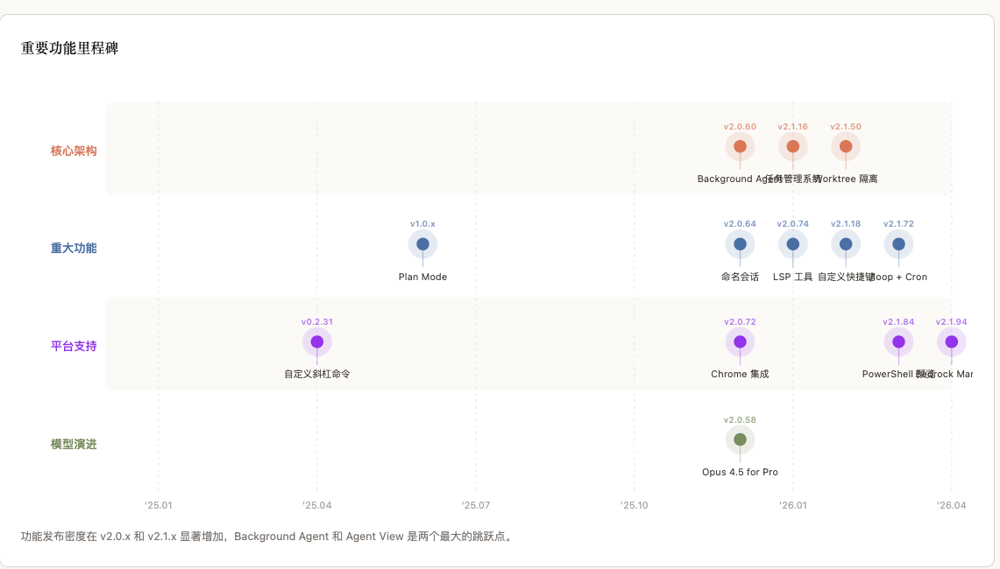

# Claude Code Insights

> **📝 博客深度解读**: [Claude Code Insights: 版本演进追踪与知识库](https://michaelmaomao.github.io/2026/06/09/Claude-Code-Insights-%E7%89%88%E6%9C%AC%E6%BC%94%E8%BF%9B%E8%BF%BD%E8%B8%AA%E4%B8%8E%E7%9F%A5%E8%AF%86%E5%BA%93/) —— 版本编年史、文章知识库评分体系、HTML 示例集详解

> 系统化追踪 Claude Code 版本演进与 Anthropic 技术生态的知识库。

**[English](README_EN.md)** | 中文

## 快速预览

| 模块 | 在线预览 | 说明 |
|------|---------|------|
| 版本编年史 | **[打开 →](https://frizzlefur.github.io/claude-code-insights/version-chronicle/index.html)** | v0.2.21 → v2.1.150，15 个里程碑 |
| 文章知识库 | **[打开 →](https://frizzlefur.github.io/claude-code-insights/articles-hub/site/index.html)** | 42 篇文章 + 7 维评分仪表盘 |
| HTML 示例集 | **[打开 →](https://frizzlefur.github.io/claude-code-insights/html-showcase/index.html)** | 20 个零依赖交互演示 |





三大模块，**零依赖**（纯 HTML/CSS/JS，无需构建工具），克隆即可浏览。

## 模块概览

### [版本编年史](https://michaelmaomao.github.io/2026/06/09/Claude-Code-Insights-%E7%89%88%E6%9C%AC%E6%BC%94%E8%BF%9B%E8%BF%BD%E8%B8%AA%E4%B8%8E%E7%9F%A5%E8%AF%86%E5%BA%93/#版本编年史) — Claude Code 版本时间线

追踪 Claude Code 从 **v0.2.21 到 v2.1.150** 的完整演进历程。

- **15 个里程碑版本**，含详细功能拆解
- **4 个时代划分**（初创 → 成长 → 成熟 → 加速），可展开时间线
- **模型演进卡片**（Opus / Sonnet / Haiku 迭代路径）
- **SVG 图表**：环形图、热力图、面积图、里程碑时间线
- **三阶段路线图**：已发布 / 快速迭代中 / 长期愿景
- **交互功能**：分类筛选、卡片/时间线视图切换、依赖关系图





### [文章知识库](https://michaelmaomao.github.io/2026/06/09/Claude-Code-Insights-%E7%89%88%E6%9C%AC%E6%BC%94%E8%BF%9B%E8%BF%BD%E8%B8%AA%E4%B8%8E%E7%9F%A5%E8%AF%86%E5%BA%93/#文章知识库) — Anthropic 精华文章系统

对 **42 篇 Anthropic 技术文章**进行系统化评分、分类和索引。

**7 维加权评分体系**：

| 维度 | 权重 | 衡量 |
|------|------|------|
| 技术深度 | 1.1 | 细节和准确性 |
| 可操作性 | 1.3 | 能否直接落地 |
| 创新性 | 1.0 | 是否提出新概念 |
| 影响力 | 1.3 | 社区传播和衍生项目 |
| 教育价值 | 1.1 | 学习帮助程度 |
| 时效性 | 1.0 | 长期保值程度 |
| 可复现性 | 1.0 | 能否照着做 |

- **5 类分类体系**：Agent 开发、工程实践、模型研究、工具平台、安全政策
- **GitHub 项目映射**：关联 85+ Anthropic 仓库和社区衍生项目
- **静态站生成器**：Python 脚本生成零依赖 HTML 仪表盘
- **42 篇详情页**：每篇文章含评分拆解、核心要点、关联资源


### [HTML 示例集](https://michaelmaomao.github.io/2026/06/09/Claude-Code-Insights-%E7%89%88%E6%9C%AC%E6%BC%94%E8%BF%9B%E8%BF%BD%E8%B8%AA%E4%B8%8E%E7%9F%A5%E8%AF%86%E5%BA%93/#html-示例集) — 零依赖交互演示

20 个独立的 HTML 示例，展示 HTML 作为通用输出格式的强大能力。*基于 [Anthropic "The unreasonable effectiveness of HTML"](https://github.com/anthropics/html-effectiveness)。*

| 类别 | 示例 |
|------|------|
| 探索 | 代码方案、视觉设计 |
| 代码 | Code Review、代码理解、设计系统、组件变体 |
| 原型 | 动画、交互 |
| 沟通 | 幻灯片、状态报告、事故报告、PR 文档 |
| 图表与研究 | 流程图、功能/概念解释器 |
| 编辑器 UI | 分诊看板、Feature Flags、Prompt 调参器 |

## 目录结构

```
claude-code-insights/
├── version-chronicle/          # 单页 HTML，~126K
│   └── index.html              # 浏览器直接打开
├── articles-hub/               # Python 驱动的静态站
│   ├── data/                   # YAML 文章数据 + JSON 索引
│   │   └── articles/           # 每篇文章一个 YAML 文件
│   ├── docs/                   # 评分标准 & 方法论
│   ├── scripts/                # 生成脚本 (Python)
│   └── site/                   # 生成的 HTML（42 篇 + 仪表盘）
├── html-showcase/              # 20 个独立 HTML 演示
│   ├── index.html
│   └── 01-20 *.html
└── README.md
```

## 浏览方式

**在线访问**（GitHub Pages）：

| 模块 | 在线地址 |
|------|---------|
| 版本编年史 | [frizzlefur.github.io/.../version-chronicle](https://frizzlefur.github.io/claude-code-insights/version-chronicle/index.html) |
| 文章知识库 | [frizzlefur.github.io/.../articles-hub](https://frizzlefur.github.io/claude-code-insights/articles-hub/site/index.html) |
| HTML 示例集 | [frizzlefur.github.io/.../html-showcase](https://frizzlefur.github.io/claude-code-insights/html-showcase/index.html) |

**本地浏览**：克隆后直接打开对应 HTML 文件，零安装零构建。

## 数据来源

| 来源 | 覆盖范围 |
|------|---------|
| [ClaudeLog](https://claudelog.com/claude-code-changelog/) | 完整版本历史（11,376 行） |
| [GitHub Releases](https://github.com/anthropics/claude-code/releases) | 最新版本 |
| [Anthropic Blog](https://www.anthropic.com/blog) | Engineering + Research 文章 |
| Code with Claude 2026 Keynote | 路线图信息 |

## 归属说明

- **HTML 示例集**：基于 [Anthropic html-effectiveness](https://github.com/anthropics/html-effectiveness)（Apache License 2.0）
- **文章内容**：所有文章版权归 Anthropic 所有，本项目仅供个人学习研究

## License

MIT（原创代码）。HTML 示例集保留 Anthropic Apache License 2.0。
